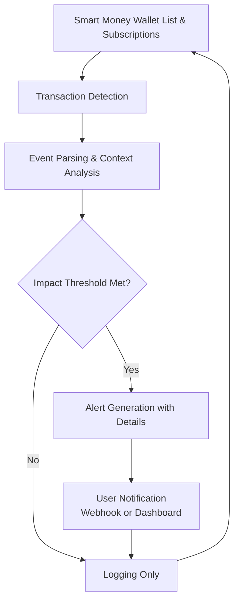

# Smart Money Tracker Crypto

Deploy Smart Money Tracker Crypto as a real-time on-chain surveillance execution layer for tracking high-conviction wallet activity, large transfers, and smart money flows across Ethereum, Solana, and major blockchains with customizable alerts and analytics.

### Introduction to Smart Money Tracking Tools

"Smart money" wallets often provide leading indicators for market moves. A **Smart Money Tracker Crypto** functions as a specialized **address monitoring and transaction analysis engine** that identifies and tracks wallets with proven track records or significant influence on price action.

Traders, analysts, and researchers use these tools to follow high-conviction flows and gain insights into market sentiment directly from on-chain activity.

### Inside the System: Core Mechanism

The tracker operates as a **multi-chain address subscription and event processing layer**. It monitors:

- Predefined or dynamically discovered smart money wallets
- Large token transfers and swaps
- Liquidity provision and position changes
- Cross-chain movements and funding activities

Detected activity is analyzed for context and delivered as alerts or visualized with historical performance data.

### Target Audience and Practical Use Cases

This execution layer targets:
- Copy-traders following proven smart money wallets
- On-chain analysts studying whale behavior
- Portfolio managers tracking influential addresses
- Market researchers analyzing capital flows

Common applications include:
- **Smart money movement alerts**
- **Copy-trading signal generation**
- **Market sentiment inference** from large flows
- **Competitive intelligence** for project teams

### Technical Architecture and Operational Logic

A robust Smart Money Tracker Crypto includes:

- **Address Monitoring Layer**: Real-time transaction subscriptions
- **Wallet Classification Engine**: Smart money identification and scoring
- **Event Analysis Module**: Contextual transaction evaluation
- **Alert & Visualization Hub**: Rich notifications and flow dashboards
- **Historical Database**: Performance tracking of followed wallets

**Operational Logic Flowchart**

### Key Features and Technical Advantages

- **Smart Money Identification**: Dynamic or curated wallet lists
- **Multi-Chain Coverage**: Ethereum, Solana, and major ecosystems
- **Contextual Alerts**: Rich transaction details and historical patterns
- **Performance Tracking**: Track record of followed wallets
- **Integration Ready**: Webhooks for trading bots or dashboards

The system provides actionable on-chain intelligence focused on influential capital flows.

### Where It Fits in the Market: Comparison Table

| Aspect                | Smart Money Tracker Crypto | Basic Wallet Trackers | Whale Alert Services  | Manual On-Chain Analysis |
|-----------------------|----------------------------|-----------------------|-----------------------|--------------------------|
| Focus                | High-conviction flows     | General addresses     | Popular whales        | Broad research           |
| Real-Time Alerts     | Customizable              | Basic                 | Predefined            | None                     |
| Multi-Chain          | Broad                     | Varies                | Limited               | Limited                  |
| Automation           | Strong integration        | Moderate              | Basic                 | None                     |
| Best Use Case        | Following smart money     | General monitoring    | Popular addresses     | Deep investigation       |
| Analytics            | Performance tracking      | Basic                 | Basic                 | Manual                   |

### Risk Surface and Limitations

Smart money tracking tools have practical constraints:
- **False Signals**: Not every large move from "smart" wallets is profitable
- **Wallet Camouflage**: Sophisticated actors use multiple addresses
- **Data Completeness**: RPC/indexer gaps can miss transactions
- **Over-Reliance**: Following smart money should complement personal analysis
- **Copy-Trading Risks**: Replicating trades does not guarantee profits

**Optimization Note**: Curate followed wallets carefully, use meaningful filters, combine with other signals, and maintain realistic expectations. Public on-chain data has limitations in attribution and intent.

### Deployment Profile and Getting Started

1. **Infrastructure**: Reliable RPC providers and stable hosting.
2. **Configuration**: Define smart money watchlists, filters, and notification channels.
3. **Testing**: Monitor known active wallets to validate alerts.
4. **Integration**: Connect webhooks to trading systems or notification services.
5. **Maintenance**: Regularly update followed addresses and refine filters.

Many solutions offer web-based dashboards or self-hosted options with community smart money lists.

### Conclusion

The Smart Money Tracker Crypto serves as a powerful on-chain surveillance execution engine for following influential wallet activity. Its value lies in real-time monitoring, contextual alerts, and performance tracking rather than predictive accuracy. For informed users who combine it with broader analysis and risk management, it provides a significant advantage in understanding and reacting to high-conviction on-chain flows.

### FAQ

**How accurate is smart money tracking for prediction?**  
It provides valuable context but is not predictive on its own. Many large moves are hedging or profit-taking.

**Does it support Solana and Ethereum?**  
Yes. Leading trackers support major chains with specialized parsers for each ecosystem.

**Can it automate copy-trading?**  
Advanced versions include optional automated replication with risk controls.

**Is monitoring public wallets legal?**  
Yes, as blockchain data is public. However, respect privacy and terms of service when using derived insights.

**What are the main costs?**  
Premium RPC subscriptions and hosting for self-hosted solutions. Many basic tracking tools are available at low or no cost.
